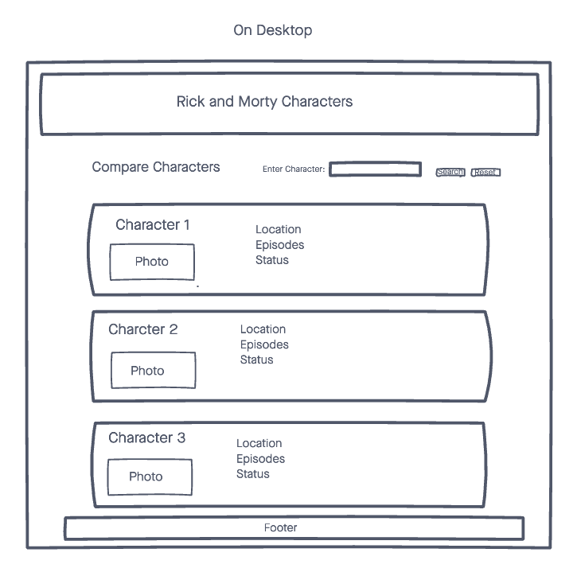
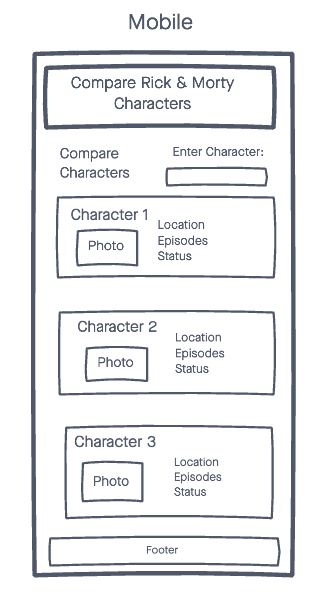
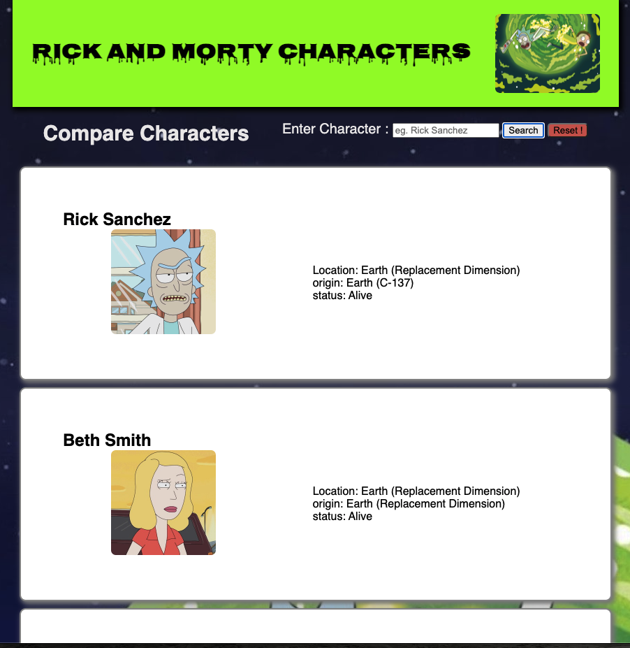
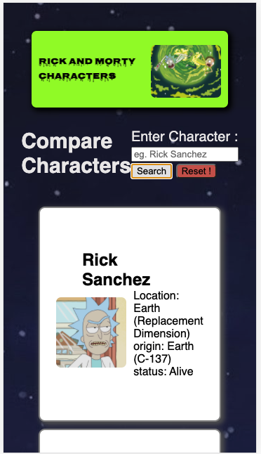

# Rick and Morty Character Analysis

1. A simple web app that dislays Rick and Morty characters and allows you to compare basic stats.
2. Input Character Name eg. Beth Smith, Simple character stats are displayed on one of 3 cards.
3. Each character entered goes to the next card and loops back to the first card.
4. There is a reset button to clear out everything and begin all over again.
5. If a character that is not on the list is entered, user is prompted 'Character Does Not Exist'.
6. Clicking the image of the character displayed takes you directly to a google search for said character.
7. Optimized to fit a variety of screen sizes.

## ⚙️ Technologies Used
- HTML5
- CSS3
- JS
- jQuery
- [Rick and Morty API](https://rickandmortyapi.com/)
- Github pages for deployment.

## 📸 Screenshots

## 🏎 💨 Getting Started

[click here](https://bawumbila.github.io/Rick-and-Morty/) to get started with app online. 

## 🛠 Future Enhancements

- Further Optimization to run more efficiently.
- Minor UI tweeks.
- Possible Animations.